# Finance Application — Complete Operating Flow

Yeh document batata hai ke application **asli code** ke mutabiq kaise chalti hai: login, RBAC, roles, screens, aur har business task ka status sequence.

Click-by-click demo values ke liye `USER_WISE_APPLICATION_OPERATING_GUIDE.md` dekhein. Yeh file system ka operating model hai.

**Flow diagrams** (Mermaid — GitHub / Cursor preview mein render hote hain):

| Diagram | Section |
|---|---|
| Big picture + request path | §1 |
| Login / session | §2 |
| RBAC 3 layers | §3 |
| Org chart (users) | §4 |
| Approval workflows + SoD decide | §6 |
| Spend → card | §9 |
| Card txn + expense | §10 |
| Reimbursement | §11 |
| Vendor bank + bill pay + payment run | §12 |
| Procurement → PO → match | §13 |
| Travel | §14 |
| Accounting sync | §15 |
| Full-day handoff (sequence) | §18 |

Local URLs:

| App | URL |
|---|---|
| Web | `http://localhost:3000` (agar port busy ho to terminal wala port, aksar `3002`) |
| API | `http://localhost:3001` |
| Worker | BullMQ — outbox, payments, documents, accounting |

Web browser sirf web origin se baat karta hai. `/api/*` Next.js API par proxy karta hai.

---

## 1. Application kya karti hai

Yeh ek company finance portal hai. Ek organization (workspace) ke andar log company ke paise control karte hain:

1. Employee spend maangta hai.
2. Manager aur Finance approve karte hain.
3. System virtual card ya fund issue karta hai, ya bill / reimbursement / travel / purchase order aage badhta hai.
4. Card charge ya payout ke baad accounting queue mein entry aati hai.
5. Finance code karke ERP (local mock) par sync karta hai.

Har action tenant ke andar rehta hai. Doosri company ka data kabhi nahi dikhta. Har important change audit log mein likha jata hai.

Local development mein card issuer, payment rail, travel booking, OCR, aur ERP **mock / sandbox** hain. Production mein card authorization sandbox band hai.

### Big picture

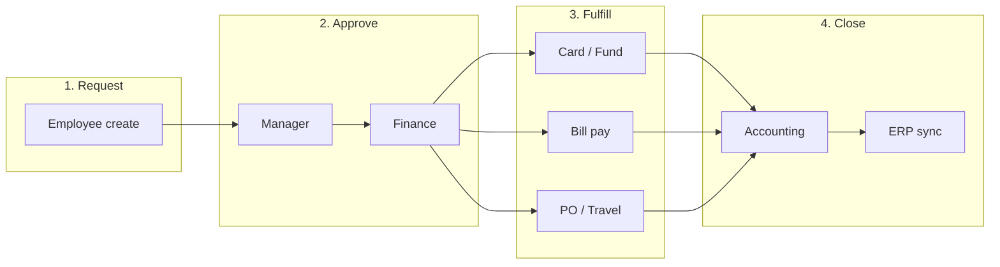

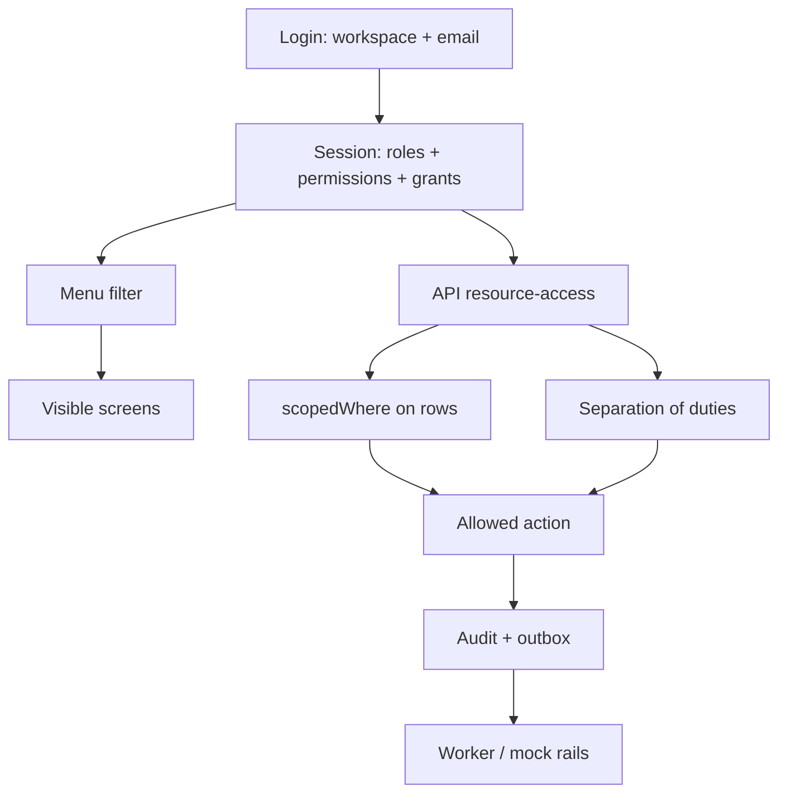

---

## 2. Login aur tenancy

Login page: `/login`

| Field | Seed value |
|---|---|
| Workspace | `acme` |
| Password | `password123` (ya `SEED_PASSWORD`) |

Workspace slug organization select karta hai. Same email do companies mein ho sakta hai; slug ke baghair login ambiguous ho jata hai.

Seeded organization:

| Cheez | Value |
|---|---|
| Name | Acme Manufacturing |
| Slug | `acme` |
| Legal entities | Acme US LLC (`US`, `USD`), Acme UK Ltd (`GB`, `GBP`) |
| Department | Engineering |
| Location | Austin |
| US rails | ACH, CHECK, WIRE |
| UK rails | FPS, SWIFT |

Session mein teen cheezein aati hain:

- **roles** — role ke naam, jaise `Owner`, `Manager`
- **permissions** — permission keys, jaise `expense.approve`
- **grants** — har permission ka **scope** aur optional legal entity

Menu aur API dono isi session se decide karte hain ke user kya dekh sakta hai aur kya likh sakta hai.

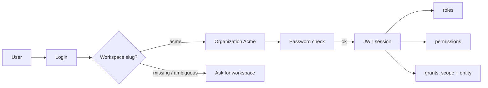

---

## 3. RBAC kaise kaam karta hai

RBAC ke teen layers hain. Teeno pass hone chahiye.

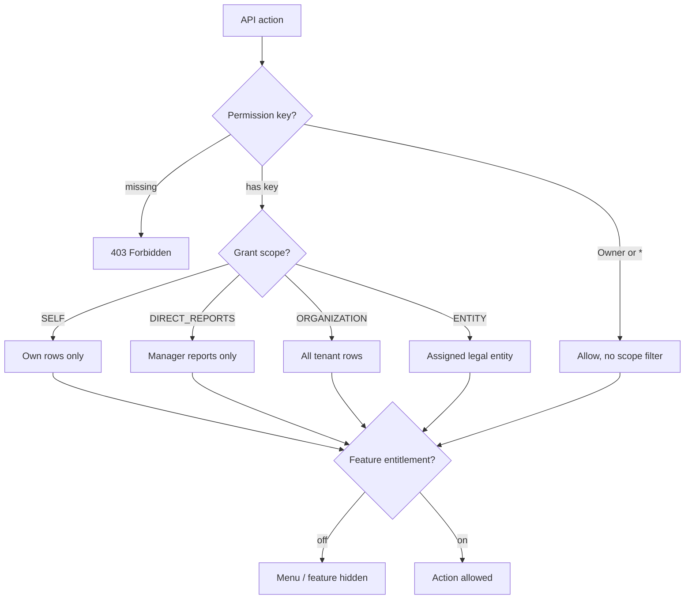

### Layer 1 — Permission key

Har action ek key maangta hai. Key na ho to API `403 Forbidden` deta hai.

`Owner` role, ya permission `*`, baqi keys ko bypass karti hai. Narrow scope apply nahi hota. Owner poori organization dekhta hai.

### Layer 2 — Scope

Permission hone ka matlab poora tenant nahi. Grant ka scope batata hai **kin rows** par woh permission lagti hai.

| Scope | Matlab |
|---|---|
| `SELF` | Sirf apna record (requester / cardholder / expense owner) |
| `DIRECT_REPORTS` | Woh users jinka `managerId` aap hain |
| `DEPARTMENT` | Aap ke department ke users |
| `TEAM` | Team scope (model mein hai; seed isay use nahi karta) |
| `LOCATION` | Location scope (model mein hai; seed isay use nahi karta) |
| `ASSIGNED` | Assigned records |
| `ENTITY` | Ek legal entity |
| `MULTI_ENTITY` | Kai legal entities |
| `ORGANIZATION` | Poori company, us tenant ke andar |
| `VENDOR_SCOPED` | Vendor portal style scope |
| `CUSTOM_SCOPE` | Custom filter |

Seeded grants:

| Role | Scope | Asar |
|---|---|---|
| Owner | `ORGANIZATION` + `*` | Sab kuch |
| Finance Admin | `ORGANIZATION` | Har permission, lekin `*` nahi. Poori company ke records |
| Manager | `DIRECT_REPORTS` | Sirf apni team ke records |
| Employee | `SELF` | Sirf apne records |

Write par `assertEntityPermission` yeh bhi check karta hai ke role us **legal entity** se judi ho. Seed mein sab users `Acme US LLC` se jude hain. UK entity par unke grants nahi hain, Owner ke ilawa.

List APIs `scopedWhere` lagati hain. Manager ko Elena ki expense dikhegi. Elena ko Miles ki expense nahi dikhegi. Finance Admin ko company ki saari expenses dikhengi.

Card transactions ka scope cardholder se niklta hai: `SELF` apne cards, `DIRECT_REPORTS` team ke cards.

### Layer 3 — Feature entitlement

Organization par modules on/off hote hain: `cards`, `expenses`, `bill_pay`, `procurement`, `travel`, `accounting`, `treasury`, aur baqi. Seed mein sab enabled hain. Entitlement off ho to menu item gayab ho jata hai, chahe permission ho.

### Menu rule

`apps/web/src/config/navigation.ts` har item par permission lagata hai.

- Item par koi permission na ho (Overview, Inbox, Search, Notifications) to har logged-in user dekh sakta hai.
- `permission` ek key maangta hai.
- `permissions` array mein **koi ek** key kaafi hai.
- `phase: P1` ya `P2` tab tak chhupa rehta hai jab tak `NEXT_PUBLIC_ENABLE_P1_ROUTES` / `NEXT_PUBLIC_ENABLE_P2_ROUTES` true na hon.
- `permission: "*"` sirf Owner (ya `*` grant) ko dikhta hai.

API menu se zyada sakht hai. URL khol lena permission nahi deta.

---

## 4. Roles aur seeded users

Database mein **char roles** hain. Alag AP role ya Treasury role nahi. Tessa aur Aiden dono **Finance Admin** hain. Unka farq permission ka nahi, **kaam ki division aur separation of duties** ka hai.

Reporting line:

```text
Ava Admin (Owner)
  └── Miles Manager (Manager)
        └── Elena Employee (Employee)

Tessa Treasury (Finance Admin) — manager set nahi
Aiden Payable (Finance Admin) — manager set nahi
```

| User | Email | Role | Scope | Entity |
|---|---|---|---|---|
| Ava Admin | `admin@acme.test` | Owner | Organization | Acme US LLC |
| Miles Manager | `manager@acme.test` | Manager | Direct reports | Acme US LLC |
| Elena Employee | `employee@acme.test` | Employee | Self | Acme US LLC |
| Tessa Treasury | `treasury@acme.test` | Finance Admin | Organization | Acme US LLC |
| Aiden Payable | `ap@acme.test` | Finance Admin | Organization | Acme US LLC |

Password sab ka: `password123`.

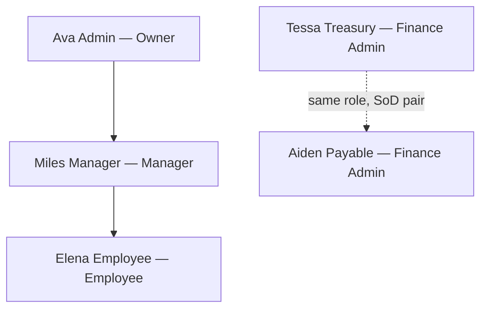

### Owner — Ava

Full access. Company setup, policies, approval rules, people, roles, audit, aur har workflow ka finance step. `*` ki wajah se P1/P2 screens bhi tab dikhti hain jab feature flag on ho.

### Finance Admin — Tessa aur Aiden

`*` ke ilawa **har permission**, organization scope par. Dono yeh kar sakte hain:

- Bills banana aur approve karna
- Payments schedule aur release karna
- Payment runs
- Cards issue / freeze
- Spend programs, vendors, bank details
- Accounting code aur sync
- People, roles, policies, approval rules
- Procurement review, travel finance approval
- Treasury transfers (UI P1 flag ke bina chhupi hai)
- Audit aur reports

Dono **ek hi role** hain. Ek hi banda apna bill approve nahi karega, apni payment release nahi karega, aur bill ke do alag control steps khud approve nahi karega. Is liye demo mein kaam baantain:

| Kaam | Kaun kare | Doosra banda |
|---|---|---|
| Bill banana, payment schedule karna, payment run banana | Tessa | Aiden release / doosra approval |
| AP pehla bill approval, payment release | Aiden | Tessa pehla step ya schedule |
| Final finance approval jahan Ava manager step kar chuki ho | Tessa ya Aiden | Ava doosra distinct step nahi karegi |

### Manager — Miles

Sirf yeh keys, aur sirf **apni direct reports** par (seed mein sirf Elena):

| Permission | Kaam |
|---|---|
| `expense.approve` | Team expense approve |
| `expense.read` | Team expenses dekhna |
| `spend_request.approve` | Team spend request ka manager step |
| `reimbursement.approve` | Team reimbursement approve |
| `travel.approve` | Team trip ka manager step |
| `procurement.review` | Purchase orders, receiving, match, change orders |
| `card.read` | Team ke cards, funds, transactions dekhna |

Miles spend request **create** nahi kar sakta, bill pay nahi kar sakta, payment release nahi kar sakta, accounting sync nahi kar sakta, aur company settings nahi khol sakta.

Manager step tabhi Miles karega jab record ke requester ka `managerId` Miles ho. Elena ke records par yeh true hai. Kisi aur employee par nahi.

### Employee — Elena

Sirf apne records, yeh keys:

| Permission | Kaam |
|---|---|
| `spend_request.create` | Spend request banana |
| `card.read` | Apna card, fund, transactions |
| `expense.create` / `expense.read` | Apni expense complete karna, receipt |
| `reimbursement.create` | Apna reimbursement |
| `travel.book` | Apni trip, search, quote, book |
| `procurement.request` | Purchase request create aur submit |

Elena approve, pay, sync, ya company admin nahi kar sakti.

---

## 5. Har role ko kaun se menus dikhte hain

Seeded permissions ke hisaab se. P1/P2 flags off hain, is liye Disputes, Banking, Receivables, Tax, AI, Developer, Rewards, Contracts chhupe rehte hain.

### Elena (Employee)

| Section | Dikhega |
|---|---|
| Workspace | Overview, Inbox, Search |
| My work | My card, My expenses, My requests, My reimbursements, My travel |
| Spend | Funds, Transactions |
| Expenses | Receipts |
| Procurement | Requests |
| Travel | Trips, Search |
| Insights | Notifications |

Nahi dikhega: Spend programs, company spend-request queue, Cards admin, expense review, reimbursement payout queues, vendors, bills, accounting, company settings, reports.

### Miles (Manager)

| Section | Dikhega |
|---|---|
| Workspace | Overview, Inbox, Search |
| My work | My card, My expenses (team ke records, apni create screens nahi) |
| Spend | Spend requests (approval queue), Funds, Transactions |
| Expenses | Expense review, Reimbursements, For approval |
| Procurement | Programs, Purchase orders, Receiving, Match exceptions |
| Travel | Trip requests |
| Insights | Notifications |

Nahi dikhega: My requests, My reimbursements, My travel (create permission nahi), bill pay, accounting, company admin, dashboards (`report.read` nahi).

### Tessa aur Aiden (Finance Admin)

P0 menu ka lagbhag sab:

- My work (unke paas employee wali create keys bhi hain)
- Spend programs, spend requests, cards, funds, transactions
- Expense review, receipts, reimbursement queues (approval, payout, paid, failures)
- Procurement poora P0 set, vendors
- Bills, for approval, for payment, payments, payment runs, history
- Accounting overview, needs review, ready to sync, synced, errors, rules, integrations
- Insights dashboard, budgets, notifications
- Travel trips, trip requests, search, reports
- Company: settings, entities, departments, locations, people, roles, policies, approval rules, accounting dimensions, integrations, audit log

`*` wale P1/P2 items nahi dikhte.

### Ava (Owner)

Finance Admin jaisa P0 menu, plus flag on hone par `*` wali screens. Owner scope filter nahi lagta.

---

## 6. Approval engine

Har submit par ek **approval instance** banti hai. Status `IN_REVIEW`. Due date 3 din. Amount `10000` ya us se zyada ho to priority `HIGH`.

Seeded workflows (`Company → Approval rules`):

| Object | Steps |
|---|---|
| Spend request | 1. `manager` → 2. `finance` |
| Expense | 1. `manager` |
| Reimbursement | 1. `manager` |
| Bill | 1. `ap` → 2. `finance` |
| Procurement | 1. `manager` → 2. `finance` |
| Travel | 1. `manager` → 2. `finance` |

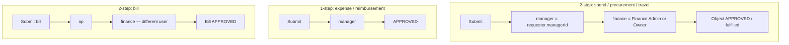

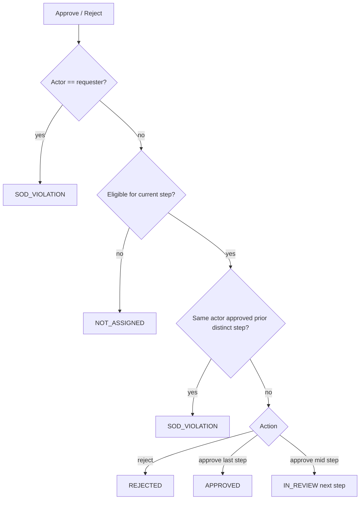

Step kaun kar sakta hai:

| Step type | Kaun eligible hai |
|---|---|
| `manager` | Requester ka asal manager (`managerId`). Role naam se nahi |
| `finance`, `ap`, `budget` | Owner, Finance Admin, Accounts Payable Admin, Controller |
| `controller` | Owner, Controller, Accounting Admin |
| `department_head` | Owner, Manager, Department Head |
| `legal`, `cfo` | Owner |
| `role` set ho | Usi naam ka role, ya Owner |
| `userId` set ho | Sirf woh user |
| Reassign | Sirf assignee. Requester ko assign nahi ho sakta |

Seed mein Accounts Payable Admin aur Controller roles **nahi** hain. `ap` aur `finance` steps Ava, Tessa, aur Aiden teeno kar sakte hain, SoD ke baad.

Instance statuses: `IN_REVIEW`, `INFO_REQUESTED`, `ESCALATED`, `APPROVED`, `REJECTED`.

Poora approve hone par object ka apna status aage badhta hai (card issue, PO, payout, waghaira). Beech ka step approve hone par object `IN_REVIEW` / `PENDING_APPROVAL` par rehta hai.

Inbox (`/app/inbox`) in approvals ki copy hai. Approver wahi se ya object page se decide karta hai.

Workflow steps amount, department, ya legal entity se filter ho sakte hain (`minAmount`, `maxAmount`, `departmentId`, `legalEntityId`). Parallel steps ek `parallelGroup` mein sab ke approve ka intezar karte hain. Seeded workflows simple sequential hain.

---

## 7. Separation of duties

Yeh errors bugs nahi. Ek user se poora paisa wala flow khatam nahi hota.

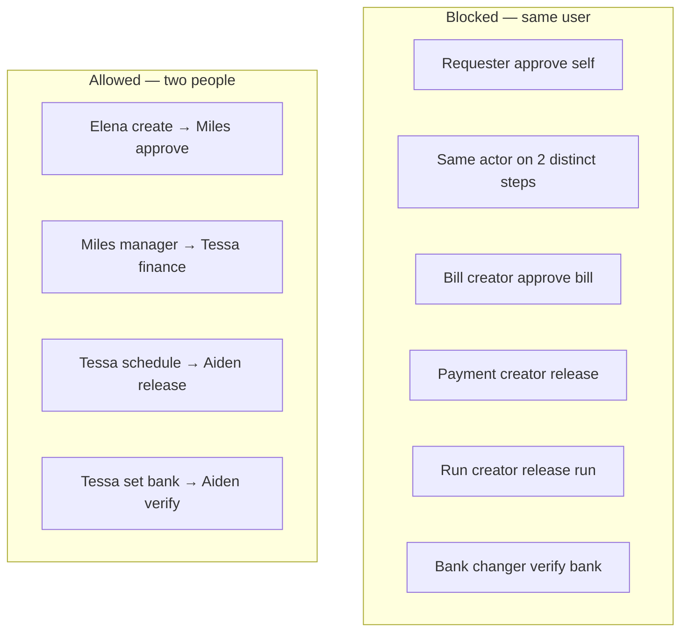

| Rule | Kya hota hai |
|---|---|
| Requester apni approval decide nahi kar sakta | Spend, expense, reimbursement, procurement, travel |
| Ek hi user do **alag** control steps approve nahi kar sakta | Manager step ke baad wahi user finance step nahi kar sakta |
| Bill banana wala us bill ko approve nahi kar sakta | `bill.createdBy` |
| Payment schedule karne wala us payment ko release nahi kar sakta | `payment.createdBy` |
| Payment run banane wala run release nahi kar sakta | Run ke andar har payment par bhi yahi |
| Bank details change karne wala unhein verify nahi kar sakta | Do users chahiye |
| Traveler apni trip approve nahi kar sakta | |
| Procurement requester apni request approve nahi kar sakta | Change order par bhi |
| Treasury transfer ka creator approve nahi kar sakta | Creator ya approver release nahi kar sakta |
| Koi apna account suspend ya terminate nahi kar sakta | |

Ava Owner hai, phir bhi woh Elena ki request ka **manager step** nahi kar sakti, kyunki Elena ka manager Miles hai. Ava finance step kar sakti hai, Miles ke approve ke baad.

Agar Ava khud Miles ka manager step kar le (Miles ka manager Ava hai), to agla finance step Tessa ya Aiden karega. Ava doosri baar block ho jayegi.

---

## 8. Policy

Policy approval se pehle chalti hai. Result `PASS`, `WARN`, `REVIEW`, ya `BLOCK`.

| Policy | Object | Rule |
|---|---|---|
| Receipt required | Expense | Amount `75` USD ya zyada ho to receipt zaroori |
| Reimbursement receipt | Reimbursement | Receipt `75+`, memo hamesha |
| Procurement | Procurement | Vendor zaroori, memo zaroori, quote `5000+`, high value `10000+` |
| Travel | Travel | Max `2500`, out-of-policy flag |
| Spend request | Spend request | Koi seeded spend policy nahi. Default high-value threshold `10000` |

`BLOCK` par spend request `BLOCKED` rehti hai aur approval start nahi hoti. Expense submit par policy block error aata hai. Procurement submit `BLOCKED` ho sakta hai.

`WARN` / `REVIEW` approval ko `HIGH` priority de sakte hain. Policy agent sirf recommend karta hai. Woh approve, pay, ya RBAC override nahi kar sakta.

---

## 9. Flow — Spend request se card tak

**Kaun start karta hai:** Elena (`spend_request.create`)  
**Menu:** My work → My requests → New spend request

Zaroori cheezein:

1. Legal entity pehle (`Acme US LLC`). Currency entity se match kare (`USD`).
2. Spend program usi entity ka `ACTIVE` ho. Seed: **Software tools**, max `5000` USD, budget **Engineering 2026** (`100000` USD, owner Miles).
3. Amount program max se kam ya barabar.
4. Program par user / department / location / role eligibility ho to requester usmein ho. Seeded program par koi extra eligibility nahi.
5. Vendor ho to company ka vendor ho. Seed vendor: **OpenAI**.
6. Fulfillment: `VIRTUAL_CARD` (default) ya `FUND_ONLY`.
7. Expiry future mein ho, ya program ke default days se aaye.

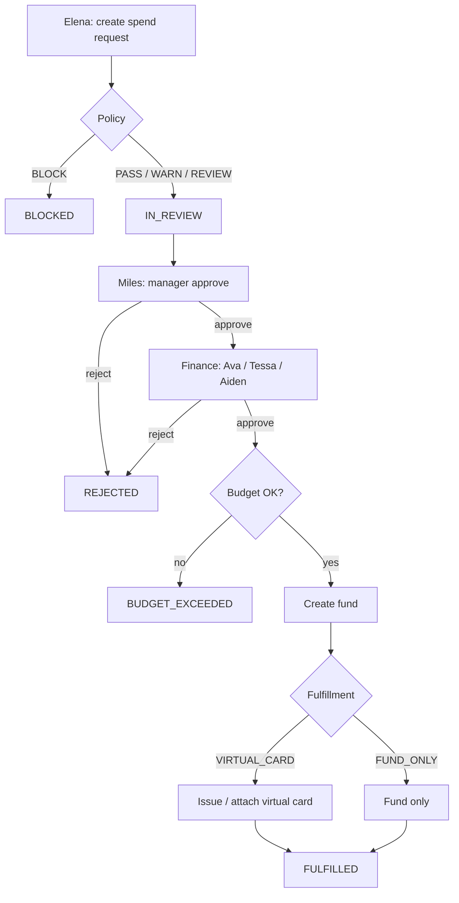

```text
Create
  → policy BLOCK?  status BLOCKED, approval nahi
  → warna status IN_REVIEW
       → step 1 manager: Miles
       → step 2 finance: Ava, Tessa, ya Aiden (Miles nahi, aur step 1 wala user nahi)
            → budget remaining check
            → fund banta hai (requester owner, amount = request)
            → VIRTUAL_CARD ho to virtual card issue / reuse
            → status FULFILLED
```

Budget par approve ke waqt `committedAmount` barhta hai. Baad mein card clear hone par committed kam hota hai aur `actualAmount` barhta hai. Budget exceed ho to final approve fail.

`FUND_ONLY` par sirf fund, card nahi.

Card controls (freeze, unfreeze, terminate, limits) `card.freeze` / `card.issue` maangte hain. Elena yeh nahi kar sakti. Tessa, Aiden, ya Ava karte hain.

Card statuses: `ACTIVE` → `FROZEN` → `ACTIVE`, ya `TERMINATED`. Suspend ya terminate user hone par uske active cards freeze ho jate hain.

Seeded cards:

| Holder | Last4 | Fund | Lock |
|---|---|---|---|
| Elena | `4242` | Elena software fund, `2500` USD | Merchant OpenAI |
| Ava | `1001` | Ava ops fund, `5000` USD | none |

---

## 10. Flow — Card transaction aur expense

Mock card use hone par:

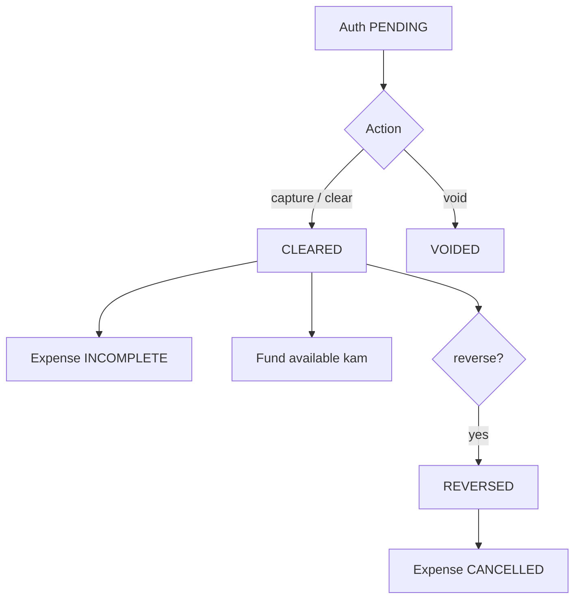

```text
Authorization PENDING
  → capture / clear → CLEARED
       → expense INCOMPLETE (cardholder ki)
       → fund available kam
  → void (sirf PENDING) → VOIDED
  → reverse (sirf CLEARED) → REVERSED, linked expense CANCELLED
```

Yeh actions `card.issue` maangte hain (Finance / Owner).

**Elena ka task** jab expense `INCOMPLETE` ya `REJECTED` ho:

Menu: My work → My expenses

1. Memo / business purpose (`update-memo`, `expense.create`).
2. Receipt agar policy maange. `75` USD se kam par seeded rule receipt nahi maangti. File PDF, PNG, ya JPEG. Upload ke baad link.
3. Optional splits. Split total expense amount ke barabar.
4. Submit. Sirf expense ka owner submit kar sakta hai (Owner bypass).

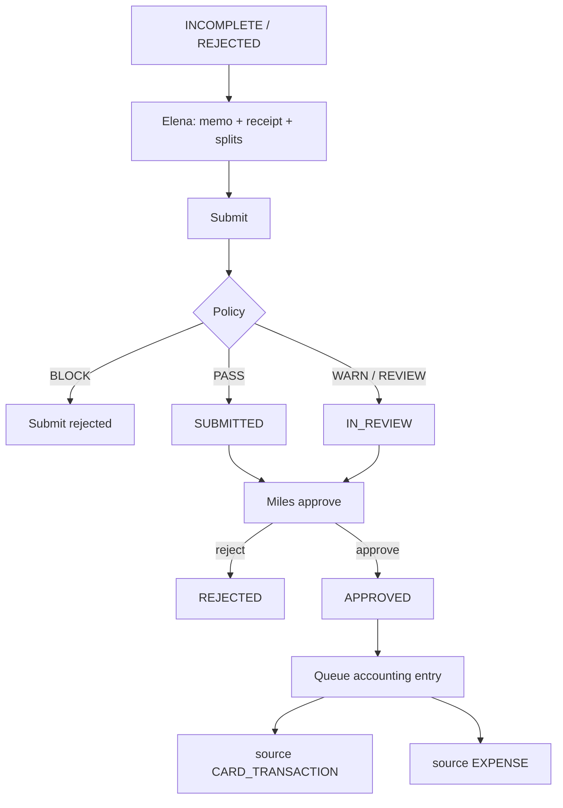

```text
INCOMPLETE or REJECTED
  → policy PASS → SUBMITTED + approval start
  → policy WARN/REVIEW → IN_REVIEW + approval start
  → policy BLOCK → submit reject
  → Miles approve (manager step, expense.approve)
  → expense APPROVED
  → accounting entry queue
       card wali expense: source CARD_TRANSACTION
       bina transaction: source EXPENSE
```

Seed mein Elena ki OpenAI expense `42.00` USD, status `INCOMPLETE`, memo pehle se hai. Amount 75 se kam hai, is liye receipt optional hai.

Company expense review queue: Expenses → Expense review. Miles yahan Elena ki submitted expense dekhta hai. Tessa / Aiden / Ava bhi `expense.approve` rakhte hain, lekin manager step sirf Miles kar sakta hai.

---

## 11. Flow — Reimbursement

**Elena** apni pocket se company kharcha.

Menu: My work → My reimbursements → New

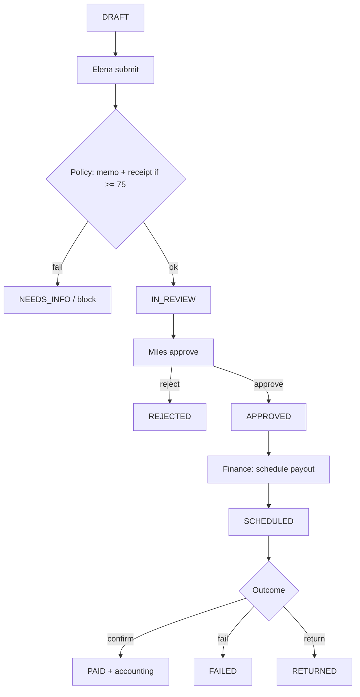

```text
DRAFT
  → submit (DRAFT ya NEEDS_INFO)
       receipt agar amount >= 75
       memo hamesha
  → IN_REVIEW (aur AWAITING_APPROVAL / POLICY_REVIEW bhi approvable hain)
  → Miles approve
  → APPROVED (READY_FOR_PAYOUT / FAILED bhi dubara schedule ho sakte hain)
  → Finance schedule payout (reimbursement.pay) → SCHEDULED
  → confirm → PAID + accounting entry
     ya fail → FAILED
     ya return → RETURNED
```

Schedule / confirm / fail `reimbursement.pay` maangta hai. Yeh Finance Admin aur Owner ke paas hai, Miles ke paas nahi.

Menus:

| Screen | Permission | Kaun |
|---|---|---|
| For approval | `reimbursement.approve` | Miles, Finance, Owner |
| For payout | `reimbursement.pay` | Tessa, Aiden, Ava |
| Paid / History, Failures | `reimbursement.pay` | Tessa, Aiden, Ava |

Payout local par sandbox / mock rail hai.

---

## 12. Flow — Vendors aur bill pay

### Vendor

Permission `vendor.create` / `vendor.read` / `vendor.bank_details.manage`. Employee ke paas nahi. Finance aur Owner.

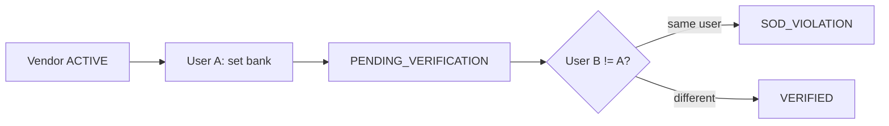

```text
Vendor ACTIVE
  → bank details set → PENDING_VERIFICATION
  → doosra user verify → VERIFIED
```

Jisne bank change kiya woh verify nahi kar sakta. Purani detail `SUPERSEDED` ho jati hai.

Seed vendor: OpenAI, category SaaS, owner Elena, entity Acme US.

### Bill

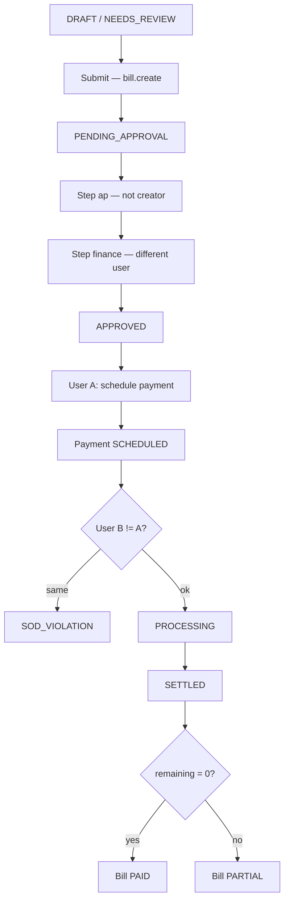

```text
DRAFT ya NEEDS_REVIEW
  → submit (bill.create) → PENDING_APPROVAL
       approval: step ap (Finance/Owner) → step finance (doosra user)
  → dono steps approve → APPROVED
  → payment create (payment.create) → payment SCHEDULED, bill remaining same
  → doosra user release (payment.release) → PROCESSING
  → confirm settlement → SETTLED
       bill remaining 0 → PAID
       warna → PARTIAL
```

Bill creator **koi bhi** approval step nahi kar sakta. Is liye bill Tessa banaye to Aiden pehla `ap` step kare, phir Ava ya koi teesra `finance` step. Aiden khud creator na ho.

Doosra pattern: Tessa banaye, Aiden `ap`, Ava `finance`. Phir payment Tessa schedule kare aur Aiden release kare. Ava ne finance approve kiya ho to woh payment release kar sakti hai, kyunki woh payment creator nahi.

Duplicate invoice `DUPLICATE_BLOCKED` na submit hoti hai na approve.

Invoice upload sandbox OCR use karta hai. OCR complete hone se pehle bill create nahi hota. Confidence `0.85` se kam ho to draft.

Seed bill: `INV-10034`, `4500` USD, status `DRAFT`, created by Ava. Ava isay approve nahi kar sakti.

### Payment run

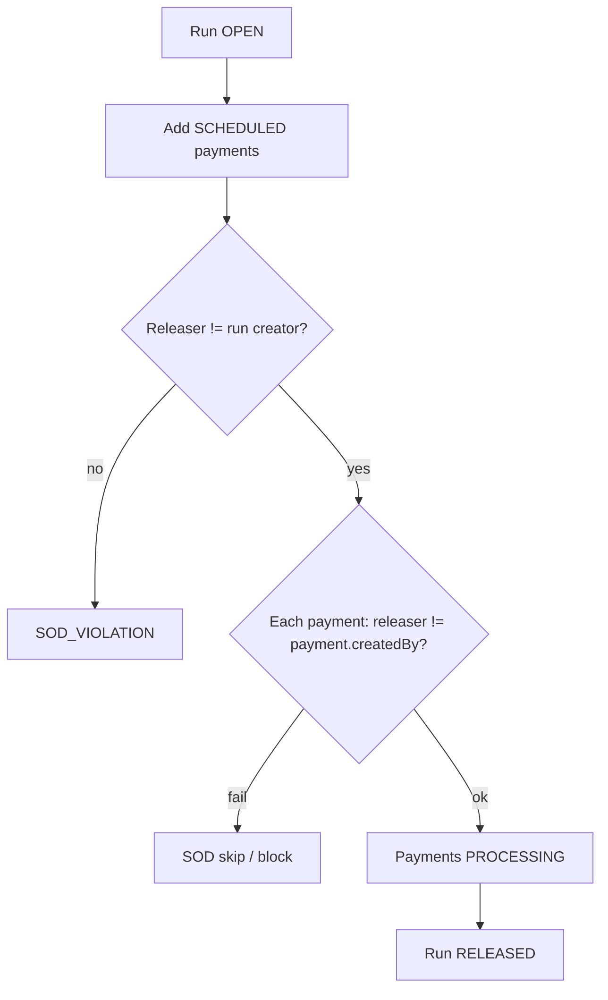

```text
OPEN  (payment_run.manage)
  → SCHEDULED payments add (jo kisi run mein na hon)
  → doosra user release
       har payment PROCESSING
       run RELEASED
```

Run creator release nahi kar sakta. Jis payment ko usi user ne schedule kiya ho, woh bhi us run mein release nahi hoti.

Payment `SCHEDULED` se `CANCELLED` ho sakti hai (`payment.create`), release se pehle.

Queues:

| Menu | Filter | Permission |
|---|---|---|
| Bills | sab | `bill.create` |
| For approval | approval stage | `bill.approve` |
| For payment | payment stage | `payment.create` |
| Payments | | `payment.create` |
| Payment runs | | `payment_run.manage` |
| History | history stage | `bill.create` |

---

## 13. Flow — Procurement

**Elena** request banati hai. **Miles** manager step. **Finance** doosra step. Review screens `procurement.review` se chalti hain.

Menu: Procurement → Requests

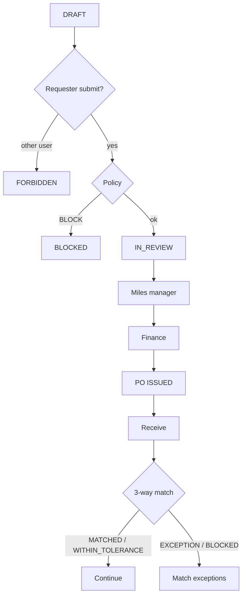

```text
DRAFT
  → sirf requester submit kare
  → policy
       BLOCK → BLOCKED
       warna approval manager → finance
  → approve hone par Purchase Order ISSUED
```

Seeded request: **Datadog expansion**, `18000` USD, outcome `PURCHASE_ORDER`, program **Software intake**, status `DRAFT`. Amount `10000` se zyada hai is liye high-value policy aur `HIGH` priority.

Policy:

- Vendor ya proposed vendor name hona chahiye.
- Memo hona chahiye.
- `5000+` par quote / attachment.
- `10000+` high value.

PO ke baad:

```text
PO ISSUED / OPEN / PARTIALLY_RECEIVED
  → receive (procurement.review)
       poora amount (aur quantity mode ho to quantity) → RECEIVED
       warna → PARTIALLY_RECEIVED
  → 3-way match bill ke sath
       MATCHED ya WITHIN_TOLERANCE → aage
       EXCEPTION / BLOCKED → Match exceptions
  → change order → doosra user approve (requester khud nahi)
```

Miles programs, POs, receiving, aur exceptions dekh sakta hai. Elena sirf apni request create / submit karti hai.

---

## 14. Flow — Travel

**Elena** trip banati hai (`travel.book`).

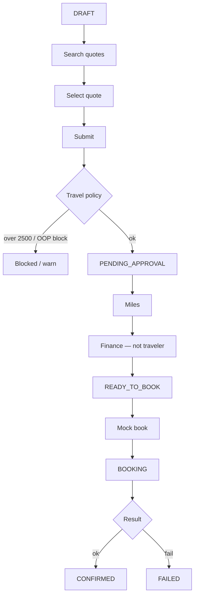

```text
DRAFT
  → search quotes (DRAFT, IN_REVIEW, PENDING_APPROVAL, APPROVED, READY_TO_BOOK, BOOKING)
  → quote select
  → submit → PENDING_APPROVAL
       policy: amount > 2500 block / out of policy
  → Miles manager step
  → Finance step (doosra user)
  → READY_TO_BOOK
  → mock book → BOOKING, phir booking CONFIRMED / FAILED
  → reprice tolerance default 25
  → cancel / refund
  → fund ya expense link
```

Traveler apni trip approve nahi kar sakta.

Seeded trip: **NYC customer visit**, 10–12 Oct 2026, estimate `1200` USD, status `DRAFT`. Elena ko notification bhi seeded hai.

Menus:

| Screen | Permission | Kaun |
|---|---|---|
| My travel, Trips, Search | `travel.book` | Elena, Finance, Owner |
| Trip requests | `travel.approve` | Miles, Finance, Owner |
| Reports | `report.read` | Finance, Owner |

---

## 15. Flow — Accounting

Jab expense approve hoti hai, reimbursement pay hota hai, ya koi aur source queue karta hai, `AccountingEntry` banti hai.

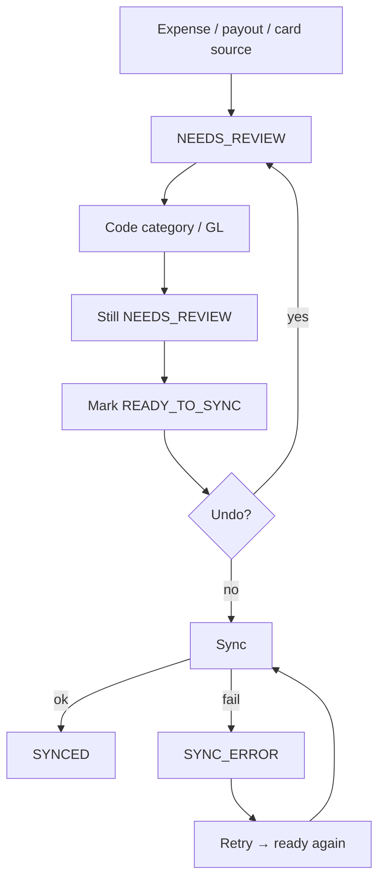

```text
NEEDS_REVIEW
  → code: category ya GL coding (accounting.code) — status phir bhi NEEDS_REVIEW
  → mark ready (coding ke baghair nahi) → READY_TO_SYNC
  → undo ready → wapas NEEDS_REVIEW
  → sync (accounting.sync) → SYNCED
     fail → SYNC_ERROR
  → retry error se wapas ready, phir sync
```

`SYNCED` entry dobara code nahi hoti.

Menus sab `accounting.read` se dikhte hain. Actions alag hain:

| Action | Permission |
|---|---|
| Code, mark ready, undo ready, rules | `accounting.code` |
| Sync, confirm, retry, ERP ping | `accounting.sync` |

Finance Admin aur Owner ke paas teeno accounting keys hain. Miles aur Elena ke paas nahi.

Seed:

- Entry source `CARD_TRANSACTION`, Elena ke `42` USD txn par, status `NEEDS_REVIEW`, category Software.
- Rule **Mileage reimbursements**: memo mein `mile` ho aur source reimbursement ho to category Travel, GL `6200`.
- ERP connection mock NetSuite, healthy. Accounting provider `MOCK_QBO`.
- Dimension **GL Category**: Software, Travel, Meals.

Worker (`pnpm dev:worker`) outbox events process karta hai. Redis down ho to `pnpm --filter @finance/worker outbox:drain` ek dafa pending events nikalta hai.

---

## 16. Flow — Company administration

`roles.assign` wali screens: Settings, Entities, Departments, Locations, Roles, Policies, Approval rules. Finance Admin aur Owner.

People:

| Action | Permission | Status |
|---|---|---|
| List | `people.read` | |
| Invite | `people.invite` | user `DRAFT`, password change zaroori |
| Activate / publish | `people.edit` | `DRAFT` → `ACTIVE` |
| Edit, assign manager / department / location | `people.edit` | |
| Suspend | `people.edit` | `SUSPENDED`, active cards `FROZEN` |
| Terminate | `people.edit` | `TERMINATED`, active cards `FROZEN`. Last owner terminate nahi hota |
| Reset credentials | `people.edit` | khud ke account par nahi |
| Assign / remove role | `roles.assign` | |

Audit log `audit.read`: Finance aur Owner. Har command actor, object, old value, new value likhta hai.

Budgets `budget.manage` se create, `report.read` se dekhne. Insights → Budgets. Seed budget Engineering 2026.

Reports / dashboard `report.read`.

Search har user ke liye hai, lekin results usi scope mein aate hain jo uske grants dete hain.

---

## 17. Treasury, receivables, AI

Yeh product mein model hai, lekin default menu mein **nahi**.

| Area | Flag | Permission | SoD |
|---|---|---|---|
| Bank accounts, transfers | `NEXT_PUBLIC_ENABLE_P1_ROUTES` | `treasury.transfer.create` | Creator approve nahi karta. Creator ya approver release nahi karta. Status approve ke baad release par `SENT` |
| Customers, invoices, incoming payments | P1 | `*` (Owner) | Seed invoice `AR-2001`, customer Northwind, `9000` USD, `SENT` |
| Disputes, tax, rewards, contracts, developer | P1 | `*` | |
| Ask AI, agents, router, token spend, sheets | P2 | `*` | Agent approve ya pay nahi kar sakta |

Seed bank accounts: Operating `1111` available `500000`, Payroll `2222` available `120000`. Yeh tab UI mein aate hain jab P1 flag on ho.

---

## 18. Ek poora din — kaun kya karta hai

Yeh seeded Acme par sahi operating order hai. Har paisa wale flow mein kam az kam do users.

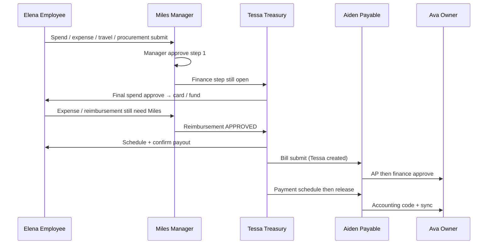

### Subah — Elena

1. Login `employee@acme.test`.
2. My requests se spend request. Entity Acme US, program Software tools, amount program max ke andar, fulfillment virtual card.
3. Status `IN_REVIEW`. Inbox mein Miles ke paas step 1.
4. My expenses: seeded `42` USD OpenAI expense par memo save karke submit. `75` se kam, receipt zaroori nahi. Phir Miles.
5. Zaroorat ho to reimbursement `DRAFT` bana kar submit.
6. Procurement request complete karke submit (vendor, memo, `5000+` par attachment).
7. My travel: NYC trip par quote select karke submit.

Elena approve button successful nahi hoga. Woh apni request ka approver nahi.

### Manager — Miles

1. Login `manager@acme.test`.
2. Inbox, ya Spend → Spend requests, Expenses → Expense review, Expenses → For approval, Travel → Trip requests.
3. Sirf Elena ke records. Har par **Approve** step 1.
4. Spend, procurement, aur travel abhi `IN_REVIEW` rehte hain. Finance ka doosra step baqi hai.
5. Expense aur reimbursement ka workflow sirf manager step hai, is liye Miles ke approve par woh `APPROVED` ho jate hain.
6. Procurement PO, receiving, match tab dekhe jab finance final approve ke baad PO issue ho.

### Finance split — Tessa aur Aiden

1. Jis flow ka manager step ho chuka ho, **doosra** user finance / ap step kare. Ava bhi finance step kar sakti hai, agar usne pehla step na kiya ho.
2. Spend final approve par fund + virtual card, status `FULFILLED`. Elena My card par naya card dekhti hai.
3. Bill: Tessa draft `INV-10034` submit kare. Aiden `ap` step. Ava ya jo creator na ho `finance` step. Phir Tessa payment schedule. Aiden release. Phir settlement confirm. Bill `PAID`.
4. Reimbursement `APPROVED` ke baad Tessa ya Aiden payout schedule aur confirm. `PAID`.
5. Travel final approve `READY_TO_BOOK`. Elena mock book karti hai.
6. Accounting → Needs review. Category ya GL. Mark ready. Ready to sync. Sync. Synced. Error aaye to Sync errors se retry.

### Admin — Ava

1. Company → People / Roles / Policies / Approval rules jab rule badalna ho.
2. Audit log se dekhna ke kis user ne approve ya release kiya.
3. Woh flow complete na kare jiska pehla step woh khud ho, ya jiska bill / payment usne banaya ho.

---

## 19. Status cheat sheet

| Object | Order |
|---|---|
| Spend request | `BLOCKED` **ya** `IN_REVIEW` → `APPROVED` → `FULFILLED` |
| Card | `ACTIVE` ↔ `FROZEN`, ya `TERMINATED` |
| Transaction | `PENDING` → `CLEARED` / `VOIDED`; `CLEARED` → `REVERSED` |
| Expense | `INCOMPLETE` → `SUBMITTED` ya `IN_REVIEW` → `APPROVED`; reject se dubara `INCOMPLETE` path `REJECTED` |
| Reimbursement | `DRAFT` → `IN_REVIEW` → `APPROVED` → `SCHEDULED` → `PAID` / `FAILED` / `RETURNED` |
| Vendor bank | `PENDING_VERIFICATION` → `VERIFIED` |
| Bill | `DRAFT` → `PENDING_APPROVAL` → `APPROVED` → `PARTIAL` / `PAID` / `CANCELLED` |
| Payment | `SCHEDULED` → `PROCESSING` → `SETTLED` / `FAILED`; ya `CANCELLED` |
| Payment run | `OPEN` → `RELEASED` |
| Purchase request | `DRAFT` → approval → PO; ya `BLOCKED` |
| Purchase order | `ISSUED` / `OPEN` → `PARTIALLY_RECEIVED` → `RECEIVED` |
| Match | `MATCHED`, `WITHIN_TOLERANCE`, `EXCEPTION`, `BLOCKED` |
| Travel | `DRAFT` → `PENDING_APPROVAL` → `READY_TO_BOOK` → `BOOKING` |
| Accounting | `NEEDS_REVIEW` → `READY_TO_SYNC` → `SYNCED` / `SYNC_ERROR` |
| User | `DRAFT` → `ACTIVE` → `SUSPENDED` / `TERMINATED` |
| Approval | `IN_REVIEW` → `APPROVED` / `REJECTED` |

---

## 20. Naye role banane ka rule

Company → Roles se naya role ban sakta hai (`roles.assign`). Permission key akeli kaafi nahi. Grant par scope lagao.

| Agar user… | Role par yeh do |
|---|---|
| Sirf apni cheezein banaye | Employee jaisi keys, scope `SELF` |
| Sirf team approve kare | Manager jaisi keys, scope `DIRECT_REPORTS`, aur user ka `managerId` sahi ho |
| Company finance chalaye lekin `*` na ho | Finance Admin jaisi keys, scope `ORGANIZATION` |
| Sab kuch | Owner, permission `*` |

Do finance users alag rakho agar bill pay chalana hai. Ek role dono ko de do, lekin **ek hi user** create aur release na kare. Workflow ke `manager` step ke liye people par manager set karna zaroori hai. Bina manager ke woh step koi complete nahi kar sakta, Owner bhi nahi, jab tak step reassign na ho.

Approval rule change `Company → Approval rules` se hota hai. Nayi version purani ko band karti hai. Jo instance pehle start ho chuki ho, woh apne saved steps par rehti hai.
