# V3 plan application flow test report

**Test date:** 2026-09-20  
**Plan under test:** `V3_IMPLEMENTATION_PLAN.md`  
**Tested scope:** company web portal, API, PostgreSQL, and worker behavior. Mobile and specialist applications were not executed because the current delivery scope is web; their required V3 capabilities are still counted as gaps.  
**Environment:** local sandbox (`web :3002`, `api :3001`, PostgreSQL `:5432`). Port `:3000` belongs to a separate local application and was not changed.

## 1. Executive verdict

The application is a **credible local company-web sandbox with substantial P0 domain behavior**, but it does **not yet meet the V3 definition of production-ready P0**.

- Direct API, web, and worker TypeScript checks passed.
- Prisma reports 13 migrations and an up-to-date database.
- The API suite passed **24 files / 62 tests**, including live PostgreSQL tests.
- Admin, manager, and employee sessions rendered role-aware navigation and representative P0 screens.
- Local database tests prove important invariants for tenancy, spend/card concurrency, expense balance, AP settlement, procurement, travel policy, accounting idempotency, and reporting.
- Real issuer, payment rail, ERP, travel, malware scanning, and payout integrations remain mock or absent.
- Redis is unavailable, 26 non-actionable/domain outbox records have no registered consumers, and continuous BullMQ delivery was not proven.
- PostgreSQL currently has zero foreign-key constraints.
- Root `pnpm --filter @finance/web typecheck` is still not reproducible in this non-interactive environment because pnpm attempts a modules purge and aborts.
- Browser mutation journeys are not automated. Current proof combines DB integration tests with authenticated read-only browser checks.

**Release decision:** suitable for a controlled demo or sandbox pilot. It is not approved for real money movement or a production P0 launch.

## 2. Test evidence

| Check | Result | Evidence |
|---|---:|---|
| API TypeScript | PASS | direct `tsc --noEmit` |
| Web TypeScript | PASS | direct `tsc --noEmit` |
| Worker TypeScript | PASS | direct `tsc --noEmit` |
| API/unit/DB suite | PASS | 24 files, 62 tests |
| Database migrations | PASS | 13 found; schema up to date |
| HTTP availability | PASS | `/health`, `/login`, and `/app/home` returned 200 |
| Authenticated API smoke | PASS | identity/me 29 ms; identity overview 17 ms; reporting 89 ms; Inbox 21 ms; audit 23 ms |
| Role access smoke | PASS at API | employee: people/bills/audit = 403; own expenses = 200; manager expenses = 200 and bills = 403 |
| Role-aware web navigation | PASS | Owner sees full workspace; Manager sees approval/expense work; Employee sees self-service items |
| Restricted-page UX | PARTIAL | API rejects access and leaks no data, but a manually entered restricted URL shows “Could not load” instead of a dedicated 403 page |
| Redis | FAIL | `localhost:6379` unavailable |
| Supported worker recovery | PASS | actionable supported outbox count = 0; dead letters = 0 |
| Whole outbox delivery | FAIL | 26 unpublished domain events have no registered consumers |
| Database referential controls | FAIL | 0 PostgreSQL foreign keys |
| Root pnpm reproducibility | FAIL | `ERR_PNPM_ABORTED_REMOVE_MODULES_DIR_NO_TTY` |
| Web inventory | PARTIAL | 99 app pages; 22 explicit stubs; 57 generic `ResourcePage` pages |
| Browser console | PASS | no functional error in tested flows; prior CSS warnings were fixed |

The API response measurements are single local smoke samples. They are not p95 load-test evidence.

## 3. Flow tested

```mermaid
flowchart LR
    A[Owner: organization and people] --> B[Employee: request or submission]
    B --> C[Policy and approval]
    C --> D[Manager or finance Inbox]
    D --> E[Card, reimbursement, PO, trip, or bill outcome]
    E --> F[Provider or sandbox processor]
    F --> G[Expense, settlement, or receipt]
    G --> H[Accounting queue]
    H --> I[ERP mock sync]
    I --> J[Dashboard, audit, search, notification]
```

### Role flow observed in the browser

1. **Owner (`admin@acme.test`)**
   - Home dashboard showed USD 42 cleared card spend, USD 4,520 open payables, USD 100,000 remaining budget, one accounting review item, and integration freshness.
   - People showed five records and active/terminated states.
   - Inbox showed one accounting exception.
   - Bill Pay showed two pending-approval bills.
   - Procurement showed a draft PO-intent request.
   - Travel showed one planned trip and clearly labeled mock booking behavior.
   - Accounting showed one needs-review, one ready, one synced, and zero error rows.
   - Audit displayed 14 material events.

2. **Manager (`manager@acme.test`)**
   - Navigation was limited to workspace, self work, spend review, transactions, expense review, and notifications.
   - Inbox was empty for the current seed.
   - Expense review showed the employee's USD 42 incomplete expense.
   - Bill access was rejected by the API.

3. **Employee (`employee@acme.test`)**
   - Navigation was limited to self-service and receipt/notification areas.
   - My cards showed one frozen virtual card with USD 2,500 available funds on the dashboard.
   - My expenses showed one USD 42 incomplete expense.
   - My reimbursements showed one USD 25 approved reimbursement.
   - Direct People, Bill Pay, and Audit API requests returned 403. Restricted web URLs did not expose records.

## 4. V3 P0 acceptance journey results

| V3 journey | Status | Proven behavior | Missing proof / blocker |
|---|---|---|---|
| Provision employee | PARTIAL | tenant-specific login, draft invite, one-time activation, role-aware navigation, People screen, self-approval protection | no full automated terminate → session revocation → card freeze journey; MFA/step-up absent; no browser create/activate test |
| Request to card transaction | LOCAL PASS | program selection, approval, single virtual-card fulfillment, fund-only outcome, concurrent authorization limit, MCC/per-transaction/velocity controls, capture, void, reversal, audit/accounting creation | mock virtual issuer only; no physical cards, provider callbacks, certification, or production latency proof |
| Expense and reimbursement | LOCAL PASS / INTEGRATION PARTIAL | clear creates one expense; receipt requirement; exact splits; mileage/per diem server calculation; self-approval blocked; payout remains separate; UI lists render | sandbox malware scan/OCR and payout; no certified scanner or live payout rail; no browser mutation suite/mobile capture |
| Bill to settlement | LOCAL PASS / PROVIDER PARTIAL | duplicate vendor/invoice control, bank-change history, approval/release SOD, partial settlement, payment-run release, no over-settlement, accounting source | mock payment rail; no signed callback contract, live retry/failure drill, or certified reconciliation |
| Procurement | LOCAL PASS | intake precedes PO, multi-step approval, SOD, correct PO lines, receiving cap, 3-way match, idempotent match, non-PO outcome | browser checked lists only; exception workflow/operational metrics not proven |
| Travel | PARTIAL | policy before booking, out-of-policy approval, requester SOD, mock hold distinct from confirmation, fund/expense links | no contracted provider; no live search/book/cancel/refund journey; travel search/policy/report pages remain stubs |
| Accounting | LOCAL PASS / ERP PARTIAL | one row per source, card/reimbursement/bill/payment normalization, rules, ready state, mock sync, idempotent external ID and retry semantics | mock QBO only; no real ERP adapter/export certification, provider reconciliation, or queue operations dashboard |
| Reporting and audit | PARTIAL | currency-separated totals, budget math, freshness, role-scoped dashboard, search, notifications, saved views, integration health, audit list | not every metric/provider event has proven drilldown/correlation; no load test, reconciliation alerts, backup/restore drill, or pilot evidence |
| Security | PARTIAL | two-tenant isolation, entity scope, API 403 matrix, SOD, idempotency conflict, document admission validation, production JWT/CORS guard | no database FKs, MFA/device management, vendor-actor matrix, delegated/forged approval matrix, stale-session suite, penetration test, or complete route authorization matrix |

## 5. Milestone assessment against this V3 plan

| Milestone | Status | Assessment |
|---|---|---|
| M0 — Stabilize baseline | PARTIAL | direct builds/tests/migrations pass; root pnpm reproducibility, CI evidence, disposable Redis fixture, and public 501 cleanup are incomplete |
| M1 — Security/data control | PARTIAL | major application-level tenancy/RBAC/idempotency/transaction/outbox controls exist; Redis delivery, full consumers, FKs, MFA, real scanning, and complete route classification remain |
| M2 — Organization/policy/approvals/Inbox | MOSTLY LOCAL | web admin, people, policy, approvals, Inbox, SOD, and role navigation work; delegated authority and mobile approval acceptance are not proven |
| M3 — Spend/cards/transactions | LOCAL PASS | strong sandbox lifecycle and concurrency tests; real issuer/callback/certification absent |
| M4 — Expenses/receipts/reimbursements | LOCAL PASS | backend lifecycle and web lists work; certified document and payout providers plus mobile/browser E2E absent |
| M5 — Vendor/AP/payment release | LOCAL PASS | local AP controls and settlement math pass; real rail/callback/reconciliation absent |
| M6 — Accounting/ERP | LOCAL PASS | queue/rules/mock sync pass; first real ERP or controlled production export absent |
| M7 — Procurement/core travel | PARTIAL | procurement passes locally; travel is mock and lacks cancel/refund/live provider acceptance |
| M8 — Reporting/release hardening | PARTIAL | dashboard, budget, search, notification, audit, and local performance smoke work; operational/security/accessibility/load/restore/pilot gates remain |
| M9 — Enterprise automation/risk | NOT RELEASE READY | multiple P1 routes are generic lists or stubs and some remain visible in primary Owner navigation before P0 hardening |
| M10 — Adjacent products | NOT RELEASE READY | AI/Agents/Router/Sheets/Developer surfaces are visible for Owner despite the V3 plan placing them behind separate P2 roadmaps |

## 6. Concrete defects and release blockers

### P0 — block production

1. **Continuous worker path is down.** Redis is unavailable, so BullMQ processing is not operating continuously.
2. **Outbox coverage is incomplete.** Twenty-six unpublished domain events remain because only payment release, accounting sync, document quarantine, and receipt OCR have processors.
3. **External providers are mocks.** Issuer, payment rail, ERP, travel, document scan/OCR, and reimbursement payout are not production integrations.
4. **Database has zero foreign keys.** Application checks cover selected paths, but the database cannot universally prevent orphan or cross-tenant references.
5. **No full browser acceptance automation.** Current UI verification is authenticated and role-based, but read-only. Financial mutations are proven in service/DB tests rather than web journeys.
6. **Security/compliance gates are incomplete.** MFA, step-up, device/session operations, vendor actors, penetration testing, retention/key custody, and provider/PCI review are not complete.

### P1 — block a trustworthy pilot expansion

7. Root pnpm execution is not reproducible in this runner; CI configuration was not found in the inspected repository paths.
8. Restricted deep links display a generic loading/error state instead of an explicit access-denied page.
9. Twenty-two explicit web stubs and 57 generic resource pages remain. A rendered generic table is not a complete lifecycle.
10. The repository still contains many scaffold controllers returning 501 and an unused local-storage adapter with unimplemented methods. Mounted route behavior must be inventoried and dead scaffolds removed or isolated.
11. Backup/restore, migration rollback, load testing, accessibility audit, failure injection, queue-age alerts, and incident runbooks are not proven.

### P2 — product boundary cleanup

12. P1/P2 navigation items such as disputes, receivables, tax, contracts, rewards, AI, Agents, Router, Sheets, and Developer Apps are visible to Owner before those products meet the plan's promotion criteria.

## 7. Recommended implementation order

1. Restore Redis and keep the continuous worker running; add consumers or an explicit retention policy for every emitted event. Add queue-age/dead-letter health endpoints and tests.
2. Add automated company-web journeys on a disposable two-tenant database for request → approval → card/expense → accounting and bill → approval → release → settlement → accounting.
3. Add tenant-safe foreign keys/composite constraints in staged migrations after orphan/backfill analysis.
4. Complete the authorization matrix, explicit 403 UI, MFA/step-up, stale-session and delegate tests.
5. Select and certify one issuer, one payment rail, one ERP, one travel provider, and one malware scanner. Keep sandbox labels until each adapter passes callback/replay/reconciliation tests.
6. Hide P1/P2 and generic/stub navigation until each route has a real lifecycle, scoped API, audit/outbox, failure handling, and acceptance test.
7. Make root pnpm and CI reproducible, then add load, accessibility, backup/restore, and security gates before pilot approval.

## 8. Final flow conclusion

The main company-web flow is coherent in sandbox form:

**Owner setup → employee self-service → manager/finance review → controlled local outcome → accounting queue → dashboard/audit**

The strongest areas are application-level financial invariants and local PostgreSQL integration tests. The weakest areas are continuous event delivery, database referential enforcement, real provider integrations, and complete browser/operations release gates. Therefore, the product can be demonstrated end to end with seeded sandbox data, but the V3 plan's production definition of done has not yet been reached.
